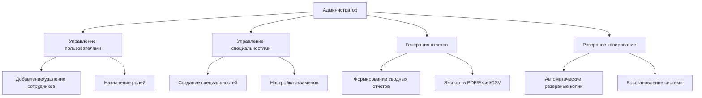
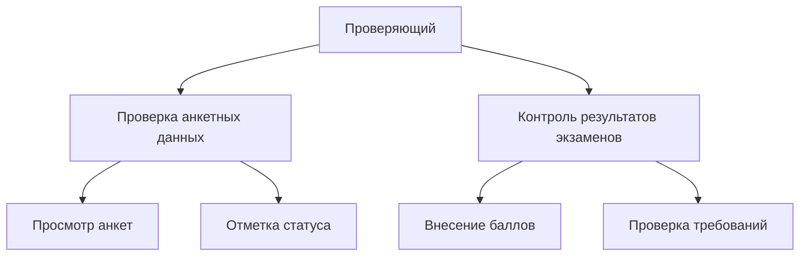
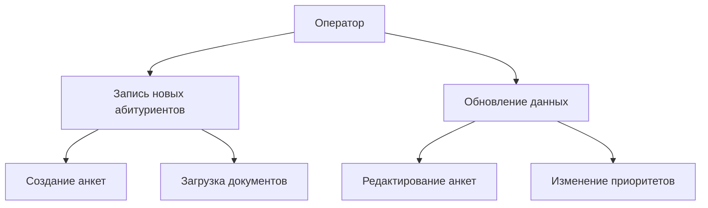
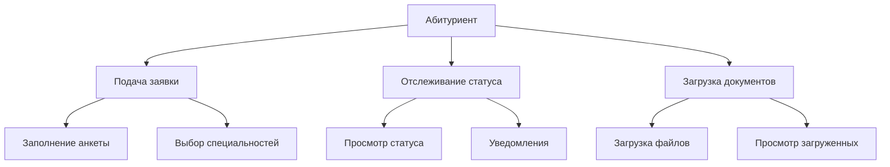

:sparkles: :sparkles: :sparkles:

# 🎓Документация к проекту "WEB-приложение для Приемной комиссии"🎓

:zap: *Версия 1.0.0* :zap:

---

## Оглавление 🔍

1. [Описание проекта](#описание-проекта)
2. [Languages&Tools](#languages&tools)
3. [Функциональность по ролям пользователей](#функциональность-по-ролям-пользователей)
4. [Установка](#установка)
5. [API](#api)
6. [Разработка](#разработка)

---
📋
## Описание проекта

### Задачи, решаемые данной системой 🚀

Система разработана для автоматизации процессов приемной комиссии и обеспечивает следующие возможности:

1. **Хранение и обработка данных абитуриентов** 📋  
   Система позволяет эффективно хранить, обновлять и анализировать информацию об абитуриентах, включая их личные данные,
   достижения и результаты экзаменов.

2. **Управление данными о сотрудниках приемной комиссии** 👥  
   Предоставляет инструменты для регистрации, редактирования и отслеживания информации о сотрудниках приемной комиссии,
   включая их роли и обязанности.

3. **Управление специальностями и экзаменационными предметами** 🎓  
   Обеспечивает возможность создания, изменения и удаления специальностей, а также связанных с ними предметов для
   вступительных испытаний.

4. **Ввод, проверка и корректировка анкетных данных** ✍️  
   Позволяет абитуриентам или сотрудникам заполнять, проверять и при необходимости корректировать анкетные данные через
   удобный интерфейс.

5. **Формирование отчетов и печатных форм** 📊  
   Поддерживает автоматическое создание различных типов отчетов и печатных форм, таких как списки абитуриентов по
   направлениям, категориям, достижениям и другим критериям.

6. **Поиск и фильтрация анкет по различным критериям** 🔍  
   Реализует мощные механизмы поиска и фильтрации анкет абитуриентов по параметрам, таким как специальность, баллы,
   статус, категория и т.д.

7. **Разграничение доступа и управление пользователями в зависимости от роли** 🔐  
   Обеспечивает безопасное использование системы путем реализации ролей пользователей (администратор, сотрудник,
   абитуриент) с соответствующими правами доступа.

---
‍💻 🛠
## Languages&Tools

<div align="center">
<table><tr>
<td valign="top" width="33%">

<h3 align="center"> Frontend </h3>
<div align="center">  
<a href="https://ru.wikipedia.org/wiki/HTML" target="_blank"></a>  
<a href="https://ru.wikipedia.org/wiki/CSS" target="_blank"></a>  
</div>

</td>

<td valign="top" width="33%">

<h3 align="center"> Backend </h3>
<div align="center">  
<a href="https://www.java.com/" target="_blank"></a>  
</div>

</td>

<td valign="top" width="33%">

<h3 align="center"> Tools </h3>
<div align="center">  
<a href="https://www.thymeleaf.org/" target="_blank"></a> 
<a href="https://spring.io/" target="_blank"></a>
</div>

</td>

<td valign="top" width="33%">

<h3 align="center"> Deploy </h3>
<div align="center">  
<a href="https://www.docker.com/" target="_blank"></a>  
</div>

</td>

</table>  

</div>

---

## Функциональность по ролям пользователей

### 1. **Для администратора** 🔐



---

### 2. **Для проверяющего** 📝



---

### 3. **Для оператора** 💻



---

### 4. **Для абитуриента** 👨‍🎓



---

## Установка

### Требования 🔧

Для запуска проекта необходимо установить следующие компоненты:

- **Java** v11+ (рекомендуется использовать LTS версию) ☕
- **Maven** (для сборки проекта и управления зависимостями) 📦
- **PostgreSQL** 12+ (или другая поддерживаемая СУБД, если настроена соответствующая конфигурация) 🗄️
- **Docker** (опционально, для упрощения развертывания базы данных) 🐳

---

### Пошаговая установка 🚀

#### 1. Клонирование репозитория 📂

Склонируйте репозиторий проекта с GitHub:

```bash
git clone https://github.com/general9k/workings
cd workings
```

### 2. Настройка базы данных 🗃️

Проект использует **PostgreSQL** в качестве основной базы данных. Вы можете настроить её двумя способами:

#### Ручная настройка:

1. Создайте новую базу данных в PostgreSQL.
2. Отредактируйте файл `.env` или `application.yml` (в зависимости от вашей конфигурации) и укажите параметры
   подключения к базе данных:
   ```properties
   spring.datasource.url=jdbc:postgresql://localhost:5432/abitur
   spring.datasource.username=postgres
   spring.datasource.password=postgres
   ```

### Использование Docker 🐳

Если у вас установлен Docker, вы можете запустить PostgreSQL в контейнере:

```bash
docker run --name postgres -e POSTGRES_PASSWORD=postgres -p 5432:5432 -d postgres
```

Для этого используйте данный файл postgresql.yml:

```dockerfile
version: '3.9'
name: devdb
services:
  postgresql:
    image: postgres:16.1
    environment:
      - POSTGRES_USER=postgres
      - POSTGRES_PASSWORD=postgres
      - POSTGRES_HOST_AUTH_METHOD=trust
    healthcheck:
      test: ['CMD-SHELL', 'pg_isready -U $${POSTGRES_USER}']
      interval: 5s
      timeout: 5s
      retries: 10
    ports:
      - 127.0.0.1:5432:5432
```

Запустите контейнер с помощью команды:

```bash
docker-compose -f postgresql.yml up -d
```

После этого обновите application.yml с соответствующими параметрами.

### 3. Установка зависимостей 📦

Убедитесь, что **Maven** установлен на вашем компьютере. Затем выполните следующую команду для загрузки всех необходимых
зависимостей:

```bash
mvn clean install
```

### 4. Запуск приложения ▶️

Для запуска приложения в режиме разработки используйте следующую команду:

```bash
mvn spring-boot:run
```

После успешного запуска приложение будет доступно по адресу:
http://localhost:8080

## API

### Основные endpoints

#### Абитуриенты (`/api/v1/abiturients`)

| Метод    | Endpoint                        | Описание                                                              |
|----------|---------------------------------|-----------------------------------------------------------------------|
| `GET`    | `/api/v1/abiturients`           | Получение списка абитуриентов с возможностью фильтрации и сортировки. |
| `POST`   | `/api/v1/abiturients/create`    | Создание нового абитуриента.                                          |
| `GET`    | `/api/v1/abiturients/create`    | Страница для создания нового абитуриента.                             |
| `GET`    | `/api/v1/abiturients/{id}/edit` | Страница для редактирования данных абитуриента.                       |
| `PUT`    | `/api/v1/abiturients/{id}/edit` | Обновление данных абитуриента по ID.                                  |
| `DELETE` | `/api/v1/abiturients`           | Удаление абитуриента по ID.                                           |
| `GET`    | `/api/v1/abiturients/print/pdf` | Генерация PDF-файла с отфильтрованными данными абитуриентов.          |

---

#### Образование (`/api/v1/educations`)

| Метод    | Endpoint                    | Описание                                           |
|----------|-----------------------------|----------------------------------------------------|
| `GET`    | `/api/v1/educations`        | Получение списка образований.                      |
| `POST`   | `/api/v1/educations/create` | Создание новой записи об образовании.              |
| `GET`    | `/api/v1/educations/create` | Страница для создания новой записи об образовании. |
| `DELETE` | `/api/v1/educations`        | Удаление записи об образовании по ID.              |

---

#### Специальности (`/api/v1/specialities`)

| Метод    | Endpoint                      | Описание                                   |
|----------|-------------------------------|--------------------------------------------|
| `GET`    | `/api/v1/specialities`        | Получение списка специальностей.           |
| `POST`   | `/api/v1/specialities/create` | Создание новой специальности.              |
| `GET`    | `/api/v1/specialities/create` | Страница для создания новой специальности. |
| `DELETE` | `/api/v1/specialities`        | Удаление специальности по ID.              |

---

#### Пользователи (`/api/v1/users`)

| Метод    | Endpoint        | Описание                        |
|----------|-----------------|---------------------------------|
| `GET`    | `/api/v1/users` | Получение списка пользователей. |
| `DELETE` | `/api/v1/users` | Удаление пользователя по ID.    |

---

#### Листы (`/api/v1/lists`)

| Метод | Endpoint        | Описание                                                     |
|-------|-----------------|--------------------------------------------------------------|
| `GET` | `/api/v1/lists` | Получение списка с возможностью фильтрации по специальности. |

---

#### Аутентификация и стартовая страница

| Метод  | Endpoint        | Описание                                  |
|--------|-----------------|-------------------------------------------|
| `GET`  | `/`             | Перенаправление на главную страницу.      |
| `GET`  | `/login`        | Страница входа в систему.                 |
| `GET`  | `/registration` | Страница регистрации нового пользователя. |
| `POST` | `/registration` | Регистрация нового пользователя.          |
| `GET`  | `/api/v1/index` | Стартовая страница системы.               |

---

### Пример запроса

Пример создания нового абитуриента:

```http
POST /api/v1/abiturients/create HTTP/1.1
Content-Type: application/json

{
  "name": "Иван Иванов",
  "categoryName": "Бюджет",
  "isAchievement": true,
  "specialityId": 5
}
```

## Разработка
### Структура проекта
```
├── src/
│   ├── main/
│   │   ├── java/
│   │   │   ├── ru/ksanxxx.abitur
│   │   │   │   ├── config/
│   │   │   │   │   ├── AuthUserDetails.java
│   │   │   │   │   └── SecurityConfig.java
│   │   │   │   ├── controller/
│   │   │   │   │   ├── api/
│   │   │   │   │   │   ├── AbiturientControllerApi.java
│   │   │   │   │   │   ├── EducationApi.java
│   │   │   │   │   │   ├── ListControllerApi.java
│   │   │   │   │   │   ├── SpecialityControllerApi.java
│   │   │   │   │   │   └── UserControllerApi.java
│   │   │   │   ├── AbiturientController.java
│   │   │   │   ├── EducationController.java
│   │   │   │   ├── ListController.java
│   │   │   │   ├── SpecialityController.java
│   │   │   │   └── UserController.java
│   │   │   ├── mapper/
│   │   │   │   ├── AuthUserMapper.java
│   │   │   ├── model/
│   │   │   │   ├── enums/
│   │   │   │   │   └── RoleEnum.java
│   │   │   │   ├── request/
│   │   │   │   │   ├── CreateAbiturientRequest.java
│   │   │   │   │   ├── CreateClientRequest.java
│   │   │   │   │   └── CreateSpecialityRequest.java
│   │   │   │   ├── Abiturient.java
│   │   │   │   ├── Achievement.java
│   │   │   │   ├── Address.java
│   │   │   │   ├── AuthUser.java
│   │   │   │   ├── Category.java
│   │   │   │   ├── Education.java
│   │   │   │   ├── Form.java
│   │   │   │   ├── Specialty.java
│   │   │   │   └── Subject.java
│   │   │   ├── repository/
│   │   │   │   ├── AbiturientRepository.java
│   │   │   │   ├── AchievementRepository.java
│   │   │   │   ├── AddressRepository.java
│   │   │   │   ├── AuthUserRepository.java
│   │   │   │   ├── CategoryRepository.java
│   │   │   │   ├── EducationRepository.java
│   │   │   │   ├── FormRepository.java
│   │   │   │   ├── SpecialtyRepository.java
│   │   │   │   └── SubjectRepository.java
│   │   │   └── service/
│   │   │   │   ├── facade/
│   │   │   │   │   │   ├── AbiturientFacade.java
│   │   │   │   │   │   ├── AchievementFacade.java
│   │   │   │   │   │   ├── AddressFacade.java
│   │   │   │   │   │   ├── CategoryFacade.java
│   │   │   │   │   │   ├── EducationFacade.java
│   │   │   │   │   │   ├── SpecialtyFacade.java
│   │   │   │   │   │   └── SubjectFacade.java
│   │   │   │   │   ├── impl/
│   │   │   │   │   │   ├── AbiturientServiceImpl.java
│   │   │   │   │   │   ├── AchievementServiceImpl.java
│   │   │   │   │   │   ├── AddressServiceImpl.java
│   │   │   │   │   │   ├── AuthUserDetailsServiceImpl.java
│   │   │   │   │   │   ├── AuthUserServiceImpl.java
│   │   │   │   │   │   ├── CategoryServiceImpl.java
│   │   │   │   │   │   ├── EducationServiceImpl.java
│   │   │   │   │   │   ├── SpecialtyServiceImpl.java
│   │   │   │   │   │   └── SubjectServiceImpl.java
│   │   │   │   │   ├── AbiturientService.java
│   │   │   │   │   ├── AchievementService.java
│   │   │   │   │   ├── AddressService.java
│   │   │   │   │   ├── AuthUserService.java
│   │   │   │   │   ├── CategoryService.java
│   │   │   │   │   ├── EducationService.java
│   │   │   │   │   ├── SpecialtyService.java
│   │   │   │   │   └── SubjectService.java
│   │   │   │   └── util/
│   │   │   │       ├── exception/
│   │   │   │       │   ├── CoreException.java
│   │   │   │       │   ├── CoreExceptionAdvice.java
│   │   │   │       │   ├── ServerError.java
│   │   │   │       │   ├── ServerLogicException.java
│   │   │   │       │   └── ServerLogicExceptionType.java
│   │   │   │       ├── interfaceEnum/
│   │   │   │       │   └── UniversalEnumConverter.java
│   │   │   │       └── RoleConverter.java
│   │   └── resources # Ресурсы проекта
│   │       ├── db.changelog # Миграции данных
│   │       ├── application.yml # Конфигурация проекта
│   │       ├── static # Стили Frontend
│   │       └── templates # Странички Fronted
│   └── test
└── pom.xml
```