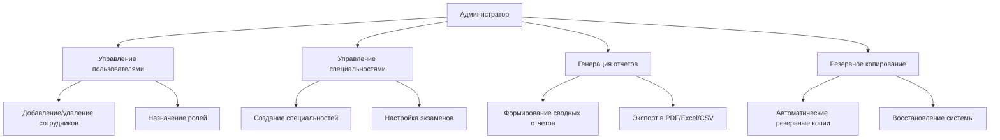
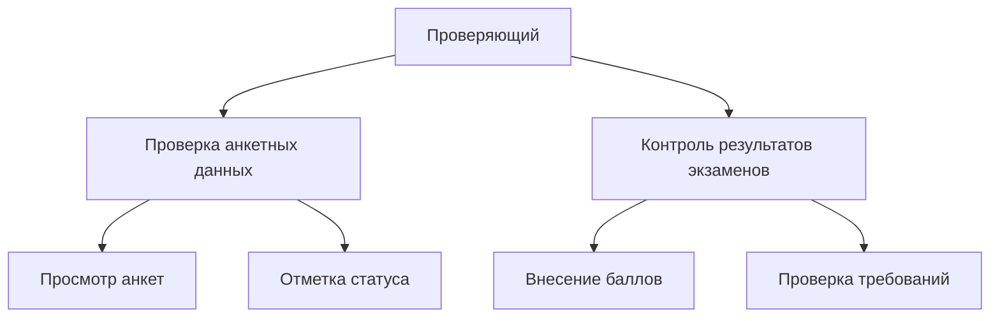
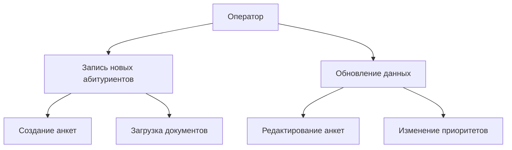
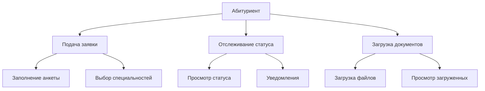

:sparkles: :sparkles: :sparkles:

# 🎓Документация к проекту "WEB-приложение для Приемной комиссии"🎓

:zap: *Версия 1.0.0* :zap:

---

## Оглавление 🔍

1. [Описание проекта 📋](#описание-проекта)
2. [Languages & Tools 👨‍💻 🛠](#функциональность)
3. [Установка](#установка)
4. [Настройка](#настройка)
5. [Использование](#использование)
6. [API](#api)
7. [Разработка](#разработка)

---

## Описание проекта 📋

### Задачи, решаемые данной системой 🚀

Система разработана для автоматизации процессов приемной комиссии и обеспечивает следующие возможности:

1. **Хранение и обработка данных абитуриентов** 📋  
   Система позволяет эффективно хранить, обновлять и анализировать информацию об абитуриентах, включая их личные данные,
   достижения и результаты экзаменов.

2. **Управление данными о сотрудниках приемной комиссии** 👥  
   Предоставляет инструменты для регистрации, редактирования и отслеживания информации о сотрудниках приемной комиссии,
   включая их роли и обязанности.

3. **Управление специальностями и экзаменационными предметами** 🎓  
   Обеспечивает возможность создания, изменения и удаления специальностей, а также связанных с ними предметов для
   вступительных испытаний.

4. **Ввод, проверка и корректировка анкетных данных** ✍️  
   Позволяет абитуриентам или сотрудникам заполнять, проверять и при необходимости корректировать анкетные данные через
   удобный интерфейс.

5. **Формирование отчетов и печатных форм** 📊  
   Поддерживает автоматическое создание различных типов отчетов и печатных форм, таких как списки абитуриентов по
   направлениям, категориям, достижениям и другим критериям.

6. **Поиск и фильтрация анкет по различным критериям** 🔍  
   Реализует мощные механизмы поиска и фильтрации анкет абитуриентов по параметрам, таким как специальность, баллы,
   статус, категория и т.д.

7. **Разграничение доступа и управление пользователями в зависимости от роли** 🔐  
   Обеспечивает безопасное использование системы путем реализации ролей пользователей (администратор, сотрудник,
   абитуриент) с соответствующими правами доступа.

---

## Languages & Tools 👨‍💻 🛠

<div align="center">
<table><tr>
<td valign="top" width="33%">

<h3 align="center"> Frontend </h3>
<div align="center">  
<a href="https://ru.wikipedia.org/wiki/HTML" target="_blank"></a>  
<a href="https://ru.wikipedia.org/wiki/CSS" target="_blank"></a>  
</div>

</td>

<td valign="top" width="33%">

<h3 align="center"> Backend </h3>
<div align="center">  
<a href="https://www.java.com/" target="_blank"></a>  
</div>

</td>

<td valign="top" width="33%">

<h3 align="center"> Tools </h3>
<div align="center">  
<a href="https://www.thymeleaf.org/" target="_blank"></a> 
<a href="https://spring.io/" target="_blank"></a>
</div>

</td>

<td valign="top" width="33%">

<h3 align="center"> Deploy </h3>
<div align="center">  
<a href="https://www.docker.com/" target="_blank"></a>  
</div>

</td>

</table>  

</div>

---

## Функциональность по ролям пользователей

### 1. **Для администратора** 🔐



---

### 2. **Для проверяющего** 📝



---

### 3. **Для оператора** 💻



---

### 4. **Для абитуриента** 👨‍🎓



---

## Установка 🛠

### Требования 🔧

Для запуска проекта необходимо установить следующие компоненты:

- **Java** v11+ (рекомендуется использовать LTS версию) ☕
- **Maven** (для сборки проекта и управления зависимостями) 📦
- **PostgreSQL** 12+ (или другая поддерживаемая СУБД, если настроена соответствующая конфигурация) 🗄️
- **Docker** (опционально, для упрощения развертывания базы данных) 🐳

---

### Пошаговая установка 🚀

#### 1. Клонирование репозитория 📂

Склонируйте репозиторий проекта с GitHub:

```bash
git clone https://github.com/general9k/workings
cd workings
```

## Установка

### 2. Настройка базы данных 🗃️

Проект использует **PostgreSQL** в качестве основной базы данных. Вы можете настроить её двумя способами:

#### Ручная настройка:

1. Создайте новую базу данных в PostgreSQL.
2. Отредактируйте файл `.env` или `application.yml` (в зависимости от вашей конфигурации) и укажите параметры
   подключения к базе данных:
   ```properties
   spring.datasource.url=jdbc:postgresql://localhost:5432/abitur
   spring.datasource.username=postgres
   spring.datasource.password=postgres
   ```

### Использование Docker 🐳
Если у вас установлен Docker, вы можете запустить PostgreSQL в контейнере:
```bash
docker run --name postgres -e POSTGRES_PASSWORD=postgres -p 5432:5432 -d postgres
```

Для этого используйте данный файл postgresql.yml:

```dockerfile
version: '3.9'
name: devdb
services:
  postgresql:
    image: postgres:16.1
    environment:
      - POSTGRES_USER=postgres
      - POSTGRES_PASSWORD=postgres
      - POSTGRES_HOST_AUTH_METHOD=trust
    healthcheck:
      test: ['CMD-SHELL', 'pg_isready -U $${POSTGRES_USER}']
      interval: 5s
      timeout: 5s
      retries: 10
    ports:
      - 127.0.0.1:5433:5432
```

Запустите контейнер с помощью команды:
```bash
docker-compose -f postgresql.yml up -d
```

После этого обновите application.yml с соответствующими параметрами.


### 3. Установка зависимостей 📦
Убедитесь, что **Maven** установлен на вашем компьютере. Затем выполните следующую команду для загрузки всех необходимых зависимостей:
```bash
mvn clean install
```

### 4. Запуск приложения ▶️

Для запуска приложения в режиме разработки используйте следующую команду:

```bash
mvn spring-boot:run
```

После успешного запуска приложение будет доступно по адресу:
http://localhost:8080

